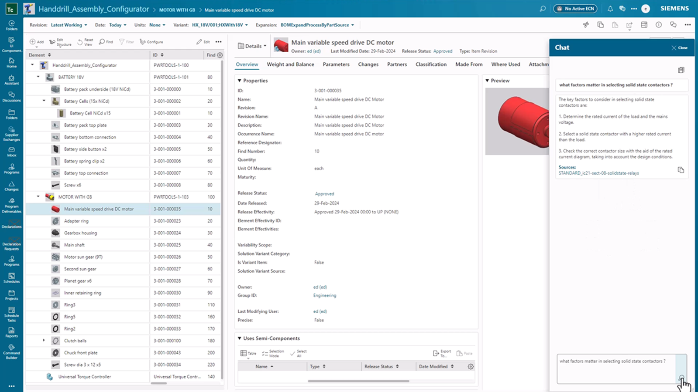

# MCMS Routing User Guide (Sprint 11 Refresh)

<!-- Page ID: routing-user-guide -->
<!-- Screenshot Source: ../../gui1.jpg shows routing hierarchy tree -->
<!-- Screenshot Source: ../../gui2.jpg shows detail modal attributes -->
<!-- Screenshot Source: ../../gui3.jpg shows search filter toolbar -->

## 1. Overview
This guide explains how editors and approvers navigate the routing workspace, inspect routing records, and refine search results. The content reflects the Sprint 11 UI build and aligns with the workflows documented in Phase 11.

## 2. Routing Hierarchy Panel
- Navigate to **Explorer ▸ Routing** to open the hierarchy tree.
- Use the breadcrumb to confirm the product and revision context before expanding child nodes.
- Toggle the **SLA Alerts** chip to highlight overdue routings.
- Drag and drop operations are tracked in the activity journal accessible from the panel header.

> Tip: Multi-select nodes with `Ctrl` and trigger batch approvals from the command ribbon.

## 3. Detail Modal Walkthrough
When selecting a routing version, press **Enter** or choose **View Detail** to open the modal.

- Review mandatory metadata in the **Summary** tab (Status, Effective Date, Version Owner).
- The **Attachments** tab shows CAD/CAM deliverables with checksum and last modified data.
- Inline comments on the right rail capture engineering sign-off. Hover timestamps for the exact UTC record.
- Use the **Version History** subpanel to compare operations; differences are highlighted in amber.

<!-- Inline context: detail modal fields map to PRD_MCS.md §4.2 -->

## 4. Search Filters
The search toolbar supports layered filters to narrow results quickly.

- Type at least three characters to activate predictive suggestions sourced from the metadata index.
- Combine filters with the **Add Condition** button (e.g., `Status: Ready`, `Owner: QA`).
- Saved filters are stored locally and synchronized when signing in on another device.
- Click **Reset** to clear all filters and return to the default hierarchy scope.

<!-- Inline context: filter persistence implemented via local storage cache key `routing_filters_v3` -->

## 5. Related Resources
- [Routing Quick-start Media Plan](Routing_QuickStart_Media.md)
- [Routing Admin Handbook](Routing_AdminHandbook.md)
- [Routing Support FAQ](Routing_SupportFAQ.md)

For onboarding sessions, embed this guide on the docs portal under `User Guides ▸ Routing`.
