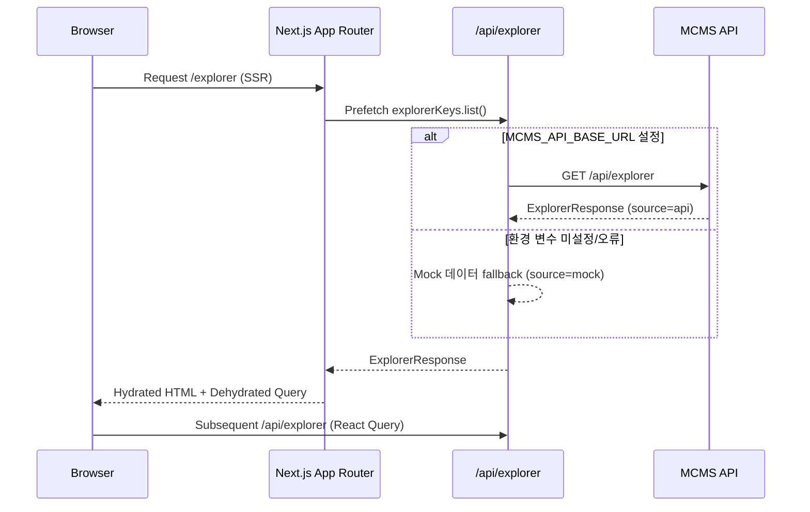

# Sprint 1 - Explorer Data Flow (Mermaid)

```mermaid
sequenceDiagram
  participant Browser
  participant NextApp as Next.js App Router
  participant BFF as /api/explorer
  participant MCMS as MCMS API

  Browser->>NextApp: Request /explorer (SSR)
  NextApp->>BFF: Prefetch explorerKeys.list()
  alt MCMS_API_BASE_URL 설정
    BFF->>MCMS: GET /api/explorer
    MCMS-->>BFF: ExplorerResponse (source=api)
  else 환경 변수 미설정/오류
    BFF-->>BFF: Mock 데이터 fallback (source=mock)
  end
  BFF-->>NextApp: ExplorerResponse
  NextApp-->>Browser: Hydrated HTML + Dehydrated Query
  Browser->>BFF: Subsequent /api/explorer (React Query)
```
