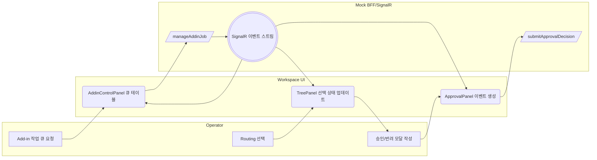

# Sprint 2 Workspace Swimlane Diagram

```mermaid
flowchart LR
  subgraph Operator
    A[Routing 선택]
    B[승인/반려 모달 작성]
    C[Add-in 작업 큐 요청]
  end

  subgraph Workspace UI
    D(TreePanel 선택 상태 업데이트)
    E(ApprovalPanel 이벤트 생성)
    F(AddinControlPanel 큐 테이블)
  end

  subgraph Mock BFF/SignalR
    G[/submitApprovalDecision/]
    H[/manageAddinJob/]
    I(((SignalR 이벤트 스트림)))
  end

  A --> D
  D --> B
  B --> E
  E --> G
  C --> F
  F --> H
  H --> I
  I --> E
  I --> F
  I --> D
```

> 실제 BFF 연동 시 G/H를 REST 엔드포인트로, I를 실제 SignalR 허브로 교체한다.